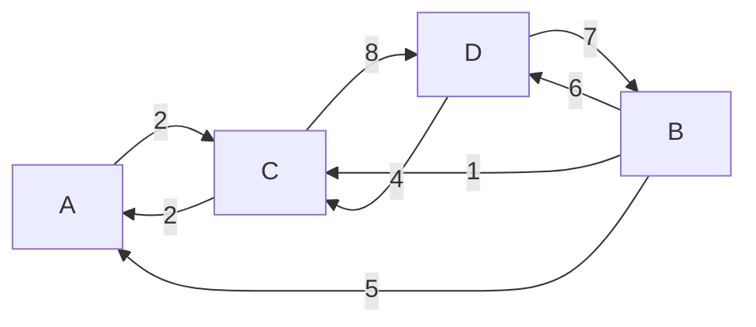

# Estructura de Datos - Grafos

## Práctica

Dado el siguiente grafo dirigido G, conteste las siguientes preguntas:

1. ¿Cuál es el grado de entrada de cada vértice del grafo G?
2. ¿Cuál es el grado de salida de cada vértice del grafo G?
3. Encontrar la matriz de adyacencia A.
4. Encontrar la matriz de caminos P, mediante las potencias de la matriz de adyacencia.
5. Encontrar todos los caminos desde el vértice A a D.
6. ¿Existen vértices fuentes o sumideros en el grafo? ¿Cuáles son?
7. Encontrar la matriz de caminos P, mediante el algoritmo de Warshall.
8. Encontrar la matriz de pesos W.
9. Encontrar la matriz de caminos mínimos Q.

---
