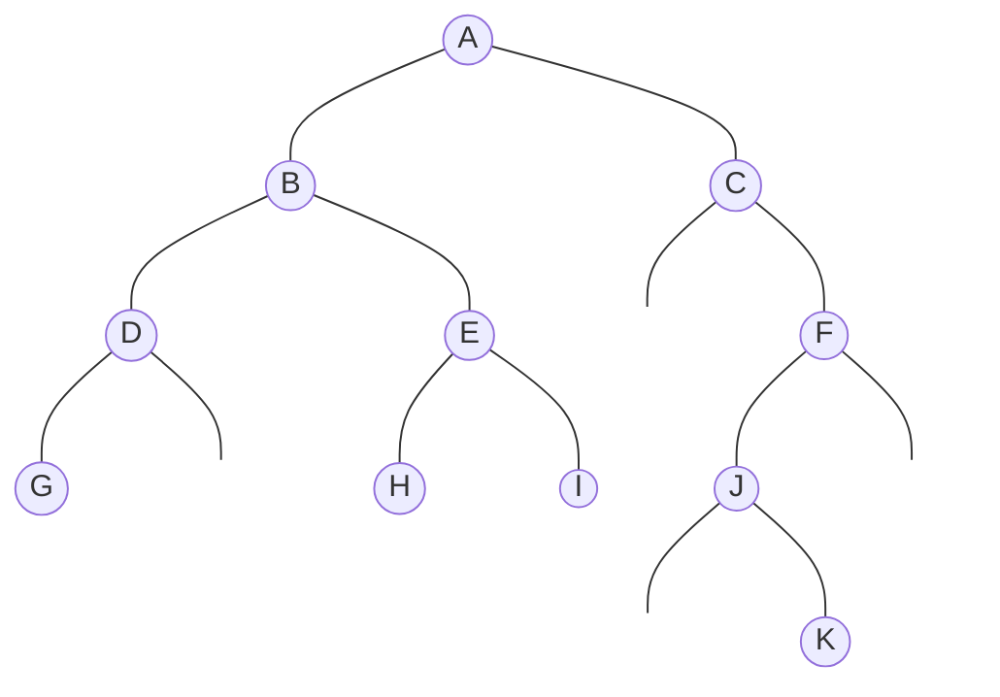

# Tarea 1

## Arboles

### Defina los siguientes conceptos de una estructura de datos árboles

a) Árboles Generales  
b) Árboles Binarios

### 2 Dado el siguiente árbol



#### a) Determinar y señalar los niveles del árbol

#### b) Determinar la altura, anchura y peso del árbol

#### c) Haga la lista de los nodos internos y nodos terminales

#### d) DIGA el grado del árbol y el grado del nodo C

#### e) Dar los recorridos PREORDEN, INORDEN y POSTORDEN

### 3. Dado los siguientes recorridos, contruir el árbol binario correspondiente.

PREORDEN: A B D G H K LC E I F J M

INORDEN: G D K H L B A E I C F J M

#### Dada la siguiente expresión algebraica en Notación INFIJA:

`* - + a / b c d * e + f g `

##### a Contruir el ábol binario de expresión aritmetica correspondiente

### Dada la siguiente Representación Enlazada en memoria de un Árbol Binario de Busqueda

| RAIZ |
| ---- |
| 3    |

| DISP |
| ---- |
| 14   |

| id  | INFO | IQZ | DER |
| --- | ---- | --- | --- |
| 1   | 35   | 8   | 5   |
| 2   | 95   | 0   | 0   |
| 3   | 65   | 13  | 7   |
| 4   | 45   | 10  | 11  |
| 5   | 38   | 0   | 0   |
| 6   |      | 0   |     |
| 7   | 60   | 0   | 9   |
| 8   | 30   | 0   | 0   |
| 9   | 85   | 12  | 2   |
| 10  | 40   | 0   | 0   |
| 11  | 48   | 0   | 0   |
| 12  | 80   | 0   | 0   |
| 13  | 50   | 4   | 0   |
| 14  |      | 6   |     |

#### Pasos

- Dibujar el Árbol binaro correspondiente
- Eliminar el nodo 50
- Insertar el nodno 42
- Insertar el nodo 68
- Eliminar el nodo 45
- Insertar el nodo 75
- eliminar el nodo 65
- Dibujar el árbol final.

    ### 5. Dado el siguiente árbol binario completo y considerando que es un ábol en monton

    ```mermaid
    graph TD
        n100((100)) --- n19((19))
        n100 --- n36((36))

        n19 --- n17((17))
        n19 --- n3((3))

        n36 --- n25((25))
        n36 --- n1((1))

        n17 --- n2((2))
        n17 --- n7((7))

        classDef inv stroke-width:0px,fill:#0000,color:#0000;
    ```

    #### Dibujar el árbol de Montón después de realizar las siguientes operaciones:
    - Se insertan: 50 - 68 - 74
    - Se eliminan: 68 - 74 - 100

### Dada la siguiente fresase "PLABLITO CLAVO UN CLAVITO CHIQUITO" Y luego aplicarle el algoritmo de Huffman
