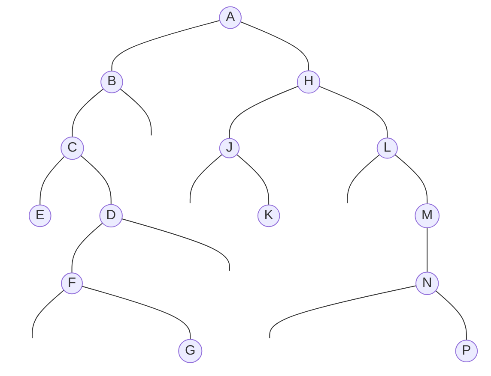
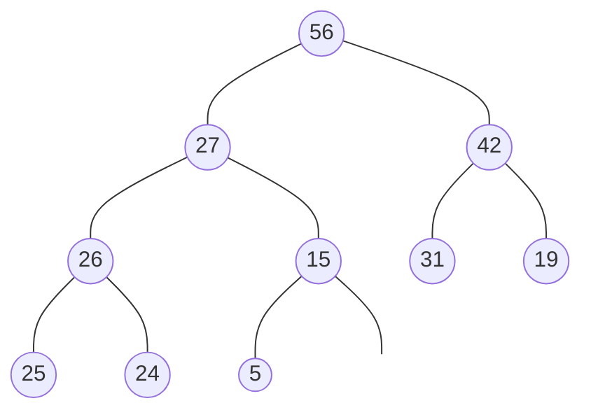

### Dado el siguiente arbol binario T.

1. Rellenar los valores de RAIZ, DIPS, IZQ y DER, correspondientes a la representación en lazada del árbol
2. dar los recorridos de preorden, inorden y postorden.
3. determinar la altura, anchura y peso del árbol.
4. Represente secuencialmente en memoria el árbol binario.

| RAIZ |
| ---- |
|      |

| DISP |
| ---- |
|      |

| id  | INFO | IQZ | DER |
| --- | ---- | --- | --- |
| 1   |      | 12  |     |
| 2   | H    |     |     |
| 3   | J    |     |     |
| 4   | C    |     |     |
| 5   | D    |     |     |
| 6   |      |     |     |
| 7   | A    |     |     |
| 8   | F    |     |     |
| 9   | G    |     |     |
| 10  | B    |     |     |
| 11  | E    |     |     |
| 12  |      |     |     |
| 13  | M    |     |     |
| 14  | L    |     |     |
| 15  | K    |     |     |
| 16  |      |     |     |
| 17  | P    |     |     |
| 18  | N    |     |     |

### Dado los siguiente recorridos:

PREORDEN: F E R L S W C A K G H D B T ? P V J

INORDEN: S L W R E K A G C F E T B D ? Q V J

### Dada la siguiente representación enlazada en memoria de un árbol binario busqueda.

1. Dibujar el árbol binario correspondiente
2. Eliminar nodo 92
3. insertar el nodo 55
4. eliminar el nodo 60
5. insertar el nodo 19
6. Dibujar el árbol final

| RAIZ |
| ---- |
| 10   |

| DISP |
| ---- |
| 1    |

| id  | INFO | IQZ | DER |
| --- | ---- | --- | --- |
| 1   |      | 0   | 0   |
| 2   | 20   | 8   | 9   |
| 3   | 62   | 0   | 0   |
| 4   | 60   | 0   | 7   |
| 5   | 10   | 0   | 0   |
| 6   | 75   | 0   | 0   |
| 7   | 85   | 12  | 15  |
| 8   | 15   | 11  | 14  |
| 9   | 35   | 0   | 0   |
| 10  | 45   | 2   | 4   |
| 11  | 12   | 5   | 13  |
| 12  | 70   | 3   | 6   |
| 13  | 14   | 0   | 0   |
| 14  | 18   | 0   | 0   |
| 15  | 92   | 0   | 16  |
| 16  | 95   | 0   | 0   |

### Dada la siguente expresión algebraica en Notación Prefija

`- a * - * b c * / d ^ e f g h`

1. Dibujar el árbol binario de expresión algebraica correspondiente

### Dado el siguiente árbol binario completo T y considerando que T es un árbol de Montón.

1. Se insertan 38, 68 , 60
2. Se eliminan 25, 42, 68

### Dada la siguiente frase "LA PICARA PAJARA PICA LA TIPICA PARAJA" y luego de parsla por el algoritmo de Huffman.

1. La listade caracteres y cuantas veces se repiten en la frase.
2. tabla de valores para construir el árbol binario extendido
3. La nueva codificación binaria para cada uno de los caracteres.
4. En cuantos bytes se almacena la fras, antes y después de la compresión
5. Calcular el porcentaje % de compresión

### Pareo

| id  |                                               |
| --- | --------------------------------------------- |
| 1   | Altura                                        |
| 2   | arboles Binarios de Búsqueda                  |
| 3   | arboles equivalentes                          |
| 4   | arboles Generales                             |
| 5   | Nivel de cada nodo                            |
| 6   | Arboles Binarios                              |
| 7   | arboles Binarios Distintos                    |
| 8   | Enlaces o ramas                               |
| 9   | Nodos                                         |
| 10  | Estructuras no Lineales                       |
| 11  | Grado de un nodo                              |
| 12  | representación en memoria de Arboles Binarios |
| 13  | Nodo terminal                                 |
| 14  | Arboles                                       |
| 15  | Arboles Binarios Similares                    |

| id  |                                                                                                                 |
| --- | --------------------------------------------------------------------------------------------------------------- |
|     | Tipo de árbol en la cual se pueden realizar las operaciones de búsqueda, inserción y eliminación                |
|     | Arboles y Grafos                                                                                                |
|     | Tienen estructuras diferentes                                                                                   |
|     | Relaciones lógicas entre los nodos de un árbol.                                                                 |
|     | La estructura y la información contenida en los nodos son idénticas.                                            |
|     | Números de ramas que deben ser recorridas para llegar a un determinado nodo                                     |
|     | En este caso la estructura del árbol son indénticas , pero la información contenida en los nodos son diferentes |
|     | Listas enlazadas y secuencial                                                                                   |
|     | Pueden tener más de 2 subarboles o hijos                                                                        |
|     | nodo que no tiene subárboles                                                                                    |
|     | Es donde se encuentra la información del un arbol                                                               |
|     | Tipo de árbol que puede tener hasta un máximo de 2 subarboles o hijos.                                          |
|     | máximo numero de nodos en cada ramo del árbol                                                                   |
|     | Son estructuas jerárquicas, normalmente en forma desenciente                                                    |
|     |                                                                                                                 |
