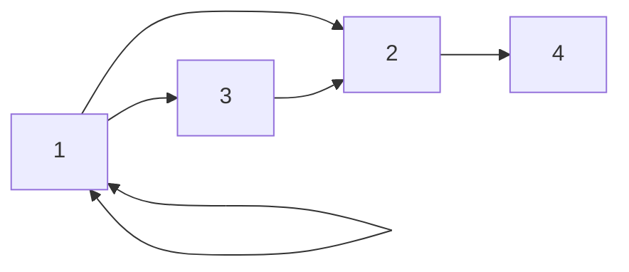

- Encontrar la matriz de caminos P, mediante las potenciasde matrices.
- Encontrar la matriz de caminos P, mediante l algoritmo de Warshall.

### Potencias de matrices

### Warshall

#### A

```
1   1   1   0
0   0   0   1
0   1   0   0
0   0   0   0
```

| C   | F     |
| --- | ----- |
| 1   | 1,2,3 |

#### P1

```
1   1   1   0
0   0   0   1
0   1   0   0
0   0   0   0
```

| C    | F   |
| ---- | --- |
| 1,3, | 4   |

`(1,4) = 0 OR [ 1 AND 1] = 0`

`(3,4) =0 OR [1 AND 1] = 0`

#### P2

```
1   1   1   1
0   0   0   1
0   1   0   1
0   0   0   0
```

| C   | F   |
| --- | --- |
| 1   | 2,4 |

#### P3

```
1   1   1   1
0   0   0   1
0   1   0   1
0   0   0   0
```

| C     | F   |
| ----- | --- |
| 1,2,3 | 0   |

#### P4

```
1   1   1   1
0   0   0   1
0   1   0   1
0   0   0   0
```
