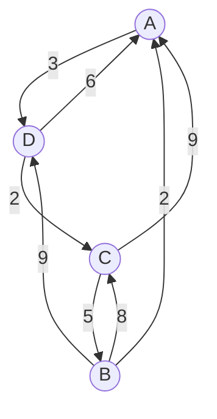

2.  Dada la siguiente matriz de adyacencia A, contestar las siguientes preguntas

$$
A=
\begin{array}{c|cccc}
 & a & b & c & d \\
\hline
a & 1 & 0 & 0 & 1 \\
b & 0 & 0 & 1 & 0 \\
c & 1 & 0 & 0 & 1 \\
d & 0 & 1 & 0 & 0
\end{array}
$$

- a) Completar el grafo insertando las aristas correspondientes.
- b) Encontrar un camino simple
- c) Encontrar en camino elemental
- d) Encontrar un circuito
- e) Encontrar un circuito Hamiltoniano
- f) Encontrar un circuito Euleriano

3. Dado el siguiente grafo con peso dirigido G:

- a. Encontrar la Matriz de Adyacencia (A) ( A-B-C-D-E ).
- b. Encontrar el grado de entrada y salida para cada nodo.
- c. Encontrar todos los caminos de del vértice B al vértice D.
- d. Encontrar la Matriz de Caminos (P), mediante el método de las potencias de matrices.
- e. Encontrar la Matriz de Caminos (P), mediante el método del algoritmo de Warshall.
- f. Encontrar la Matriz de Pesos (W).
- g. Encontrar la Matriz de Caminos Mínimos (Q)

## Respuestas

### Parte 3

#### Encontrar la Matriz de Adyacencia (A) ( A-B-C-D).

$$
A=
\begin{array}{c|cccc}
 & A & B & C & D \\
\hline
A & 0 & 0 & 0 & 1 \\
B & 1 & 0 & 1 & 1 \\
C & 1 & 1 & 0 & 0 \\
D & 1 & 0 & 1 & 0
\end{array}
$$

#### Encontrar el grado de entrada y salida para cada nodo

$$
\begin{array}{c|cc}
\text{Vértice} & Entrada & Salida\\
\hline
A & 3 & 1 \\
B & 1 & 3 \\
C & 2 & 2 \\
D & 2 & 2
\end{array}
$$

#### Potencias de Matrices

$$
A^1=
\begin{array}{c|cccc}
 & A & B & C & D \\
\hline
A & 0 & 0 & 0 & 1 \\
B & 1 & 0 & 1 & 1 \\
C & 1 & 1 & 0 & 0 \\
D & 1 & 0 & 1 & 0
\end{array}
$$

$$
A^2=
\begin{array}{c|cccc}
 & A & B & C & D \\
\hline
A & 1 & 0 & 1 & 1 \\
B & 2 & 1 & 1 & 1 \\
C & 1 & 0 & 1 & 2 \\
D & 1 & 1 & 0 & 1
\end{array}
$$

$$
A^3=
\begin{array}{c|cccc}
 & A & B & C & D \\
\hline
A & 1 & 1 & 0 & 1 \\
B & 3 & 1 & 2 & 3 \\
C & 3 & 1 & 2 & 1 \\
D & 2 & 0 & 2 & 2
\end{array}
$$

$$
A^4=
\begin{array}{c|cccc}
 & A & B & C & D \\
\hline
A & 2 & 0 & 2 & 2 \\
B & 6 & 2 & 4 & 4 \\
C & 4 & 2 & 2 & 4 \\
D & 4 & 2 & 2 & 2
\end{array}
$$

$$
B=\sum_{k=1}^{4} A^k
\begin{array}{c|cccc}
 & A & B & C & D \\
\hline
A & 4 & 1 & 3 & 4 \\
B & 12 & 4 & 8 & 9 \\
C & 9 & 4 & 5 & 7 \\
D & 8 & 3 & 5 & 5
\end{array}
$$

$$
P=
\begin{array}{c|cccc}
 & A & B & C & D \\
\hline
A & 1 & 1 & 1 & 1 \\
B & 1 & 1 & 1 & 1 \\
C & 1 & 1 & 1 & 1 \\
D & 1 & 1 & 1 & 1
\end{array}
$$

#### Algoritmo de Warshall

$$
P_k(i,j)
=
P_{k-1}(i,j)
\text{ OR }
\bigl(
P_{k-1}(i,k)
\text{ AND }
P_{k-1}(k,j)
\bigr)
$$

$$
\begin{array}{ccl}
P_0=
\begin{bmatrix}
\color{blue}{0} & \color{blue}{0} & \color{blue}{0} & \color{blue}{1} \\
\color{red}{1} & 0 & 1 & 1 \\
\color{red}{1} & 1 & 0 & 0 \\
\color{red}{1} & 0 & 1 & 0
\end{bmatrix}
&
\qquad
J=\{2,3,4\},\ I=\{4\}
&
\qquad
\{
\cancel{(2,4)},
(3,4),
(4,4)
\}
\end{array}
$$

$$
P_1=
\begin{bmatrix}
0 & \color{red}{0} & 0 & 1 \\
\color{blue}{1} & \color{purple}{0} & \color{blue}{1} & \color{blue}{1} \\
1 & \color{red}{1} & 0 & 1 \\
1 & \color{red}{0} & 1 & 1
\end{bmatrix}
\qquad
J=\{3\}
\qquad
I=\{1,3,4\}
\qquad
\{
\cancel{(3,1)},
(3,3),
\cancel{(3,4)}
\}
$$

$$
P_2=
\begin{bmatrix}
0 & 0 & \color{red}{0} & 1 \\
1 & 0 & \color{red}{1} & 1 \\
\color{blue}{1} & \color{blue}{1} & \color{purple}{1} & \color{blue}{1} \\
1 & 0 & \color{red}{1} & 1
\end{bmatrix}
\quad
J=\{1,2,3,4\}
\quad
I=\{2,3,4\}
\quad

\left\{
\begin{array}{llll}
\cancel{(2,1)} & (2,2) & \cancel{(2,3)} & \cancel{(2,4)} \\
\cancel{(3,1)} & \cancel{(3,2)} & \cancel{(3,3)} & \cancel{(3,4)} \\
\cancel{(4,1)} & (4,2) & \cancel{(4,3)} & \cancel{(4,4)}
\end{array}
\right\}
$$

$$
P_4=
\begin{bmatrix}
0 & 0 & 0 & \color{blue}{1} \\
1 & 1 & 1 & \color{blue}{1} \\
1 & 1 & 1 & \color{blue}{1} \\
\color{red}{1} & \color{red}{1} & \color{red}{1} & \color{purple}{1}
\end{bmatrix}
\quad
J=\{1,2,3,4\}
\quad
I=\{1,2,3,4\}
\quad

\left\{
\begin{array}{llll}
(1,1) & (1,2) & (1,3) & \cancel{(1,4)} \\
\cancel{(2,1)} & \cancel{(2,2)} & \cancel{(2,3)} & \cancel{(2,4)} \\
\cancel{(3,1)} & \cancel{(3,2)} & \cancel{(3,3)} & \cancel{(3,4)} \\
\cancel{(4,1)} & \cancel{(4,2)} & \cancel{(4,3)} & \cancel{(4,4)}
\end{array}
\right\}
$$

$$
P=
P_4=
\begin{bmatrix}
1 & 1 & 1 & 1 \\
1 & 1 & 1 & 1 \\
1 & 1 & 1 & 1 \\
1 & 1 & 1 & 1
\end{bmatrix}
$$

#### Pesos W

$$
W=
\begin{bmatrix}
0 & 0 & 0 & 3\\
2 & 0 & 8 & 9\\
9 & 5 & 0 & 0\\
6 & 0 & 2 & 0
\end{bmatrix}
$$

#### Matriz de Caminos Mínimos (Q)

$$
Q_k(i,j)
=
\min\Big(
Q_{k-1}(i,j),
\; Q_{k-1}(i,k) + Q_{k-1}(k,j)
\Big)
$$

$$
W = Q_0 =
\begin{bmatrix}
\infty & \infty & \infty & 3 \\
2 & \infty & 8 & 9 \\
9 & 5 & \infty & \infty \\
6 & \infty & 2 & \infty
\end{bmatrix}
\quad
J=\{2,3,4\}
\quad
I=\{4\}
\quad
\left\{
\begin{array}{l}
(2,4)\\
(3,4)\\
(4,4)
\end{array}
\right\}
$$

$$
Q_1=
\begin{bmatrix}
\infty & \infty & \infty & 3 \\
2 & \infty & 8 & 5 \\
9 & 5 & \infty & 12 \\
6 & \infty & 2 & 9
\end{bmatrix}
\quad
J=\{3\}
\quad
I=\{1,3,4\}
\quad
\left\{ (3,1), (3,3), (3,4) \right\}
$$

$$
Q_2=
\begin{bmatrix}
\infty & \infty & \infty & 3 \\
2 & \infty & 8 & 5 \\
7 & 5 & 13 & 10 \\
6 & \infty & 2 & 9
\end{bmatrix}
\quad
J=\{2,3,4\}
\quad
I=\{1,2,3,4\}
\quad
\left\{
\begin{array}{lll}
(2,1) & (2,2) & (2,3) & (2,4) \\
(3,1) & (3,2) & (3,3) & (3,4) \\
(4,1) & (4,2) & (4,3) & (4,4)
\end{array}
\right\}
$$

$$
Q_3=
\begin{bmatrix}
\infty & \infty & \infty & 3 \\
2 & 13 & 8 & 5 \\
7 & 5 & 13 & 10 \\
6 & 7 & 2 & 9
\end{bmatrix}
\quad
I=\{1,2,3,4\}
\quad
J=\{1,2,3,4\}
\quad
\left\{
\begin{array}{llll}
(1,1) & (1,2) & (1,3) & (1,4) \\
(2,1) & (2,2) & (2,3) & (2,4) \\
(3,1) & (3,2) & (3,3) & (3,4) \\
(4,1) & (4,2) & (4,3) & (4,4)
\end{array}
\right\}
$$

$$
Q = Q_4 =
\begin{bmatrix}
9 & 10 & 5 & 3 \\
2 & 12 & 7 & 5 \\
7 & 5 & 12 & 10 \\
6 & 7 & 2 & 9
\end{bmatrix}
$$
