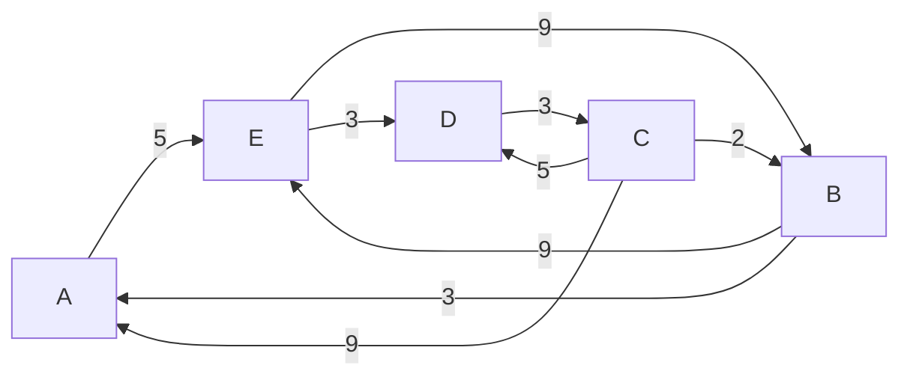

## Enunciado

### Parte 1

$$
\text{Dada la siguiente matriz de adyacencia } A,\ \text{contestar las siguientes preguntas.}
$$

$$
\begin{array}{c|ccccc}
   & A & B & C & D & E \\
\hline
A & 0 & 1 & 0 & 1 & 1 \\
B & 0 & 1 & 1 & 1 & 0 \\
C & 1 & 1 & 0 & 0 & 0 \\
D & 0 & 0 & 1 & 1 & 1 \\
E & 0 & 0 & 1 & 1 & 1
\end{array}
$$

$$
\begin{aligned}
\text{a)}\;& \text{Completar el grafo insertando las aristas correspondientes} \\
\text{b)}\;& \text{Encontrar un camino simple} \\
\text{c)}\;& \text{Encontrar un camino elemental} \\
\text{d)}\;& \text{Encontrar un circuito} \\
\text{e)}\;& \text{Encontrar un circuito hamiltoniano} \\
\text{f)}\;& \text{Encontrar un camino euleriano}
\end{aligned}
$$

### Parte 2

$$
\begin{array}{l}
\text{Dado el siguiente grafo dirigido con pesos } G:
\end{array}
$$

$$
\begin{array}{l}
\text{a) Encontrar la matriz de adyacencia } A \text{ (A, B, C, D, E).} \\
\text{b) Encontrar el grado de entrada y s
alida de cada vértice.} \\
\text{c) Encontrar todos los caminos del vértice D al vértice E.} \\
\text{d) Encontrar la matriz de caminos } P \text{ mediante el método de las potencias de matrices.} \\
\text{e) Encontrar la matriz de caminos } P \text{ mediante el algoritmo de Warshall.} \\
\text{f) Encontrar la matriz de pesos } W. \\
\text{g) Encontrar la matriz de caminos mínimos } Q.
\end{array}
$$

## Respuestas

### Parte 1

#### b) Encontrar un camino simple

$A → D → E → C
$

#### c) Encontrar un camino elemental

$E → C → B → D
$

#### d) Encontrar un circuito

$A → B → C → A$

#### e) Encontrar un circuito hamiltoniano

$A → B → D → E → C → A$

#### f) Encontrar un camino euleriano

No existe camino euleriano en el grafo, ya que no cumple las condiciones necesarias sobre los grados de entrada y salida de los vértices.

### Parte 2

#### a) Encontrar la matriz de adyacencia A (A, B, C, D, E)

$$
A=
\begin{array}{c|ccccc}
 & A & B & C & D & E \\
\hline
A & 0 & 0 & 0 & 0 & 1 \\
B & 1 & 0 & 0 & 0 & 1 \\
C & 1 & 1 & 0 & 1 & 0 \\
D & 0 & 0 & 1 & 0 & 0 \\
E & 0 & 1 & 0 & 1 & 0
\end{array}
$$

#### b) Encontrar el grado de entrada y salida de cada vértice

$$
A=
\begin{array}{c|ccccc|c}
 & A & B & C & D & E & \text{Salida} \\
\hline
A & 0 & 0 & 0 & 0 & 1 & 1 \\
B & 1 & 0 & 0 & 0 & 1 & 2 \\
C & 1 & 1 & 0 & 1 & 0 & 3 \\
D & 0 & 0 & 1 & 0 & 0 & 1 \\
E & 0 & 1 & 0 & 1 & 0 & 2 \\
\hline
\text{Entrada} & 2 & 2 & 1 & 2 & 2 &
\end{array}
$$

#### c) Encontrar todos los caminos del vértice D al vértice E

$D → C → A → E$

$D → C → B → E$

$D → C → B → A → E$

$D → C → D → C → A → E$

$D → C → D → C → B → E$

$D → C → B → E → B → E$

$D → C → A → E → B → E$

#### d) Encontrar la matriz de caminos P mediante el método de las potencias de matrices

$$
A=
\begin{array}{c|ccccc}
 & A & B & C & D & E \\
\hline
A & 0 & 0 & 0 & 0 & 1 \\
B & 1 & 0 & 0 & 0 & 1 \\
C & 1 & 1 & 0 & 1 & 0 \\
D & 0 & 0 & 1 & 0 & 0 \\
E & 0 & 1 & 0 & 1 & 0
\end{array}
$$

$$
A^2=
\begin{array}{c|ccccc}
 & A & B & C & D & E \\
\hline
A & 0 & 1 & 0 & 1 & 0 \\
B & 0 & 1 & 0 & 1 & 1 \\
C & 1 & 0 & 1 & 0 & 2 \\
D & 1 & 1 & 0 & 1 & 0 \\
E & 1 & 0 & 1 & 0 & 1
\end{array}
$$

$$
A^3=
\begin{array}{c|ccccc}
 & A & B & C & D & E \\
\hline
A & 1 & 0 & 1 & 0 & 1 \\
B & 1 & 1 & 1 & 1 & 1 \\
C & 1 & 3 & 0 & 3 & 1 \\
D & 1 & 0 & 1 & 0 & 2 \\
E & 1 & 2 & 0 & 2 & 1
\end{array}
$$

$$
A^4=
\begin{array}{c|ccccc}
 & A & B & C & D & E \\
\hline
A & 1 & 2 & 0 & 2 & 1 \\
B & 2 & 3 & 1 & 2 & 2 \\
C & 3 & 1 & 3 & 1 & 4 \\
D & 1 & 3 & 0 & 3 & 1 \\
E & 2 & 1 & 2 & 1 & 3
\end{array}
$$

$$
A^5=
\begin{array}{c|ccccc}
 & A & B & C & D & E \\
\hline
A & 2 & 1 & 2 & 1 & 3 \\
B & 3 & 2 & 2 & 3 & 4 \\
C & 4 & 7 & 1 & 7 & 4 \\
D & 3 & 1 & 3 & 1 & 4 \\
E & 3 & 5 & 1 & 5 & 3
\end{array}
$$

$$
B=
\begin{array}{c|ccccc}
 & A & B & C & D & E \\
\hline
A & 4 & 4 & 3 & 4 & 6 \\
B & 7 & 6 & 4 & 7 & 9 \\
C & 10 & 12 & 5 & 12 & 11 \\
D & 6 & 5 & 5 & 5 & 7 \\
E & 7 & 9 & 4 & 9 & 8
\end{array}
$$

$$
P=
\begin{array}{c|ccccc}
 & A & B & C & D & E \\
\hline
A & 1 & 1 & 1 & 1 & 1 \\
B & 1 & 1 & 1 & 1 & 1 \\
C & 1 & 1 & 1 & 1 & 1 \\
D & 1 & 1 & 1 & 1 & 1 \\
E & 1 & 1 & 1 & 1 & 1
\end{array}
$$

#### e) Encontrar la matriz de caminos P mediante el algoritmo de Warshall

$$

\begin{array}{ccl}
P_0=
\begin{array}{c|ccccc}
& \color{red}{A} & B & C & D & E \\
\hline
\color{blue}{A} &
\color{blue}{0} & \color{blue}{0} & \color{blue}{0} & \color{blue}{0} & \color{blue}{1} \\
B &
\color{red}{1} & 0 & 0 & 0 & 1 \\
C &
\color{red}{1} & 1 & 0 & 1 & 0 \\
D &
\color{red}{0} & 0 & 1 & 0 & 0 \\
E &
\color{red}{0} & 1 & 0 & 1 & 0
\end{array}
&
\qquad
J=\{2,3\},\ I=\{5\}
&
\qquad
\left\{
\cancel{(2,5)},
(3,5)
\right\}
\end{array}
$$

$$
\begin{array}{ccl}
P_1=
\begin{array}{c|ccccc}
 & A & B & C & D & E \\
\hline
A & 0 & \color{red}{0} & 0 & 0 & 1 \\
B & \color{blue}{1} & \color{blue}{0} & \color{blue}{0} & \color{blue}{0} & \color{blue}{1} \\
C & 1 & \color{red}{1} & 0 & 1 & 1 \\
D & 0 & \color{red}{0} & 1 & 0 & 0 \\
E & 0 & \color{red}{1} & 0 & 1 & 0
\end{array}
&
\qquad
J=\{3,5\},\ I=\{1,5\}
&
\qquad
\left\{
\begin{array}{cc}
(3,1) & (3,5) \\
\cancel{(5,1)} & \cancel{(5,5)}
\end{array}
\right\}
\end{array}
$$

#### f) Encontrar la matriz de pesos W

#### g) Encontrar la matriz de caminos mínimos Q
